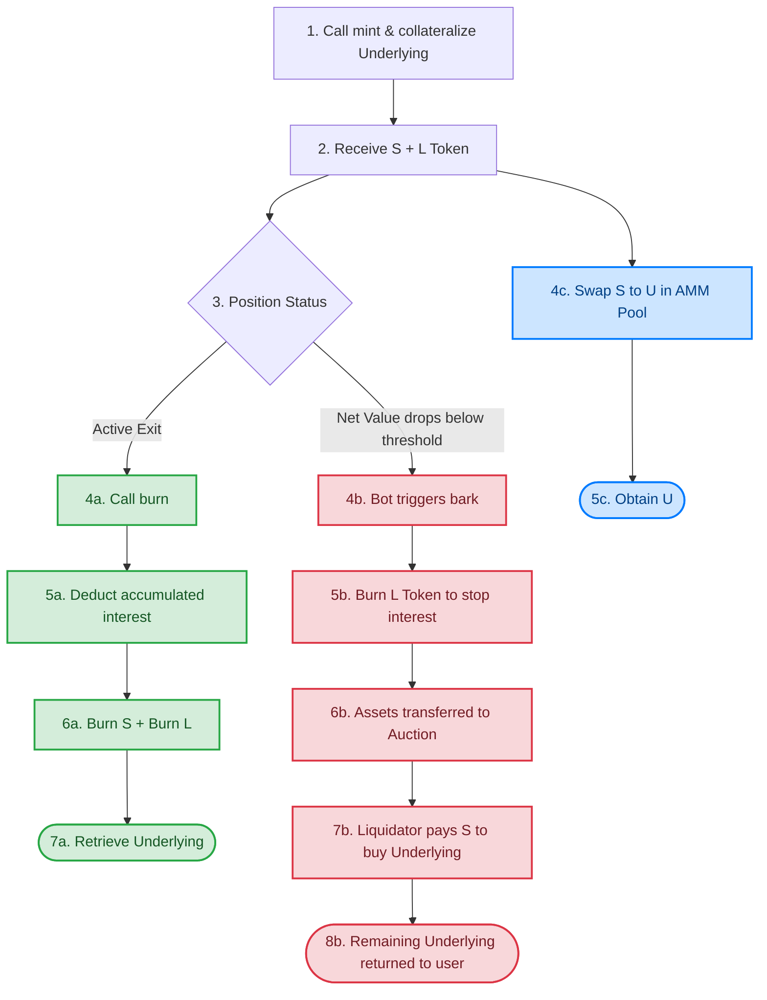

# Sample Hardhat 3 Beta Project (`node:test` and `viem`)

This project showcases a Hardhat 3 Beta project using the native Node.js test runner (`node:test`) and the `viem` library for Ethereum interactions.

To learn more about the Hardhat 3 Beta, please visit the [Getting Started guide](https://hardhat.org/docs/getting-started#getting-started-with-hardhat-3). To share your feedback, join our [Hardhat 3 Beta](https://hardhat.org/hardhat3-beta-telegram-group) Telegram group or [open an issue](https://github.com/NomicFoundation/hardhat/issues/new) in our GitHub issue tracker.

## Project Overview

This example project includes:

- A simple Hardhat configuration file.
- Foundry-compatible Solidity unit tests.
- TypeScript integration tests using [`node:test`](nodejs.org/api/test.html), the new Node.js native test runner, and [`viem`](https://viem.sh/).
- Examples demonstrating how to connect to different types of networks, including locally simulating OP mainnet.

## Usage

### Running Tests

To run all the tests in the project, execute the following command:

```shell
npx hardhat test
```

You can also selectively run the Solidity or `node:test` tests:

```shell
npx hardhat test solidity
npx hardhat test nodejs
```

### Make a deployment to Sepolia

This project includes an example Ignition module to deploy the contract. You can deploy this module to a locally simulated chain or to Sepolia.

To run the deployment to a local chain:

```shell
npx hardhat ignition deploy ignition/modules/Counter.ts
```

To run the deployment to Sepolia, you need an account with funds to send the transaction. The provided Hardhat configuration includes a Configuration Variable called `SEPOLIA_PRIVATE_KEY`, which you can use to set the private key of the account you want to use.

You can set the `SEPOLIA_PRIVATE_KEY` variable using the `hardhat-keystore` plugin or by setting it as an environment variable.

To set the `SEPOLIA_PRIVATE_KEY` config variable using `hardhat-keystore`:

```shell
npx hardhat keystore set SEPOLIA_PRIVATE_KEY
```

After setting the variable, you can run the deployment with the Sepolia network:

```shell
npx hardhat ignition deploy --network sepolia ignition/modules/Counter.ts
```

